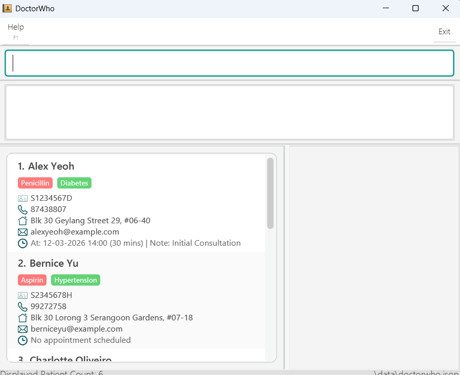

 

# DoctorWho

* This is **a software engineering project developed by team CS2103T-F10-1**.
* Team Members:
    * Khoo Jing Xi
    * Ong Kwan Kiat Kenneth
    * Sebastien Tze-An Leib
    * Chong Jia Hua Cavan
    * Sara Khan

* The project simulates an ongoing software project for a desktop application (called _DoctorWho_) used for managing patient records and appointments in a clinical setting.
    * It is **written in OOP fashion** and builds on a structured, modular codebase.
    * It aims to provide a **user-friendly command-line interface (CLI)** for doctors to efficiently manage patients and their appointments.
    * It comes with a **reasonable level of user and developer documentation**.

* We are currently developing the **Minimum Viable Product (MVP)** with the following core features:

## MVP Features

1. **Add Patient**
   Add a new patient record with details such as name, NRIC, date of birth, phone, email, address, optional medical conditions, and
   allergies.

2. **Delete Patient**
   Remove a patient record from the system. All associated appointments are deleted together with the patient.

3. **List Patients**
   Display all patients currently stored in the system.

4. **Add Appointment**
   Schedule an appointment for a patient with a specified date-time and duration, with optional notes.

5. **Delete Appointment**
   Remove a specific appointment from a patient’s record.

6. **List Appointments**
   Display all scheduled appointments across patients in chronological order, with an optional date filter.

* For the detailed documentation of this project, see the **[DoctorWho Product Website](https://ay2526s2-cs2103t-f10-1.github.io/tp/)**.

---

## Acknowledgement

This project is based on the AddressBook Level 3 project created by the [SE-EDU initiative](https://se-education.org).
