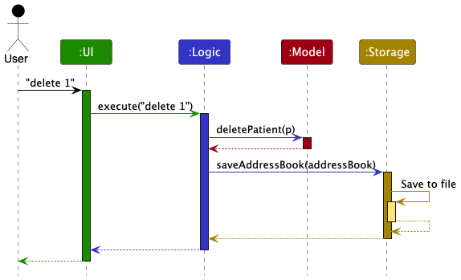
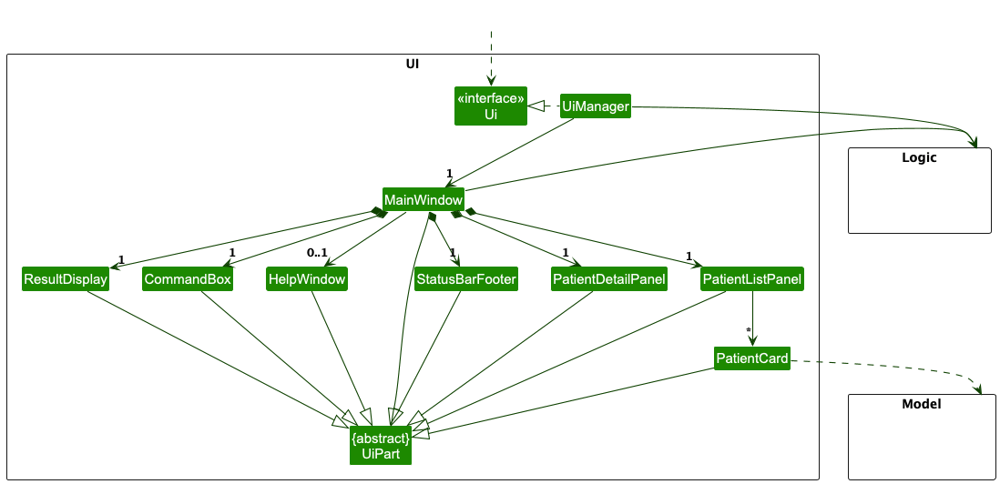
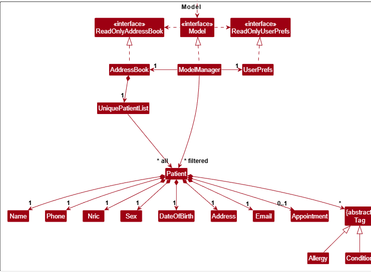
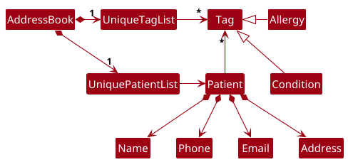
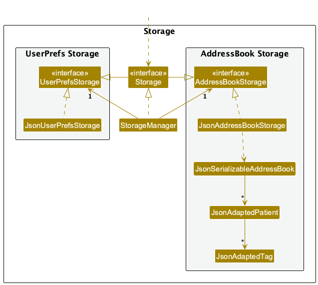

* Table of Contents
{:toc}

--------------------------------------------------------------------------------------------------------------------

## **Acknowledgements**

* {list here sources of all reused/adapted ideas, code, documentation, and third-party libraries -- include links to the original source as well}

--------------------------------------------------------------------------------------------------------------------

## **Setting up, getting started**

Refer to the guide [_Setting up and getting started_](SettingUp.md).

--------------------------------------------------------------------------------------------------------------------

## **Design**

:bulb: **Tip:** The `.puml` files used to create diagrams are in this document `docs/diagrams` folder. Refer to the [_PlantUML Tutorial_ at se-edu/guides](https://se-education.org/guides/tutorials/plantUml.html) to learn how to create and edit diagrams.

### Architecture

The ***Architecture Diagram*** given above explains the high-level design of the App.

Given below is a quick overview of main components and how they interact with each other.

**Main components of the architecture**

**`Main`** (consisting of classes [`Main`](https://github.com/se-edu/addressbook-level3/tree/master/src/main/java/seedu/address/Main.java) and [`MainApp`](https://github.com/se-edu/addressbook-level3/tree/master/src/main/java/seedu/address/MainApp.java)) is in charge of the app launch and shut down.
* At app launch, it initializes the other components in the correct sequence, and connects them up with each other.
* At shut down, it shuts down the other components and invokes cleanup methods where necessary.

The bulk of the app's work is done by the following four components:

* [**`UI`**](#ui-component): The UI of the App.
* [**`Logic`**](#logic-component): The command executor.
* [**`Model`**](#model-component): Holds the data of the App in memory.
* [**`Storage`**](#storage-component): Reads data from, and writes data to, the hard disk.

[**`Commons`**](#common-classes) represents a collection of classes used by multiple other components.

**How the architecture components interact with each other**

The *Sequence Diagram* below shows how the components interact with each other for the scenario where the user issues the command `delete 1`.

Each of the four main components (also shown in the diagram above),

* defines its *API* in an `interface` with the same name as the Component.
* implements its functionality using a concrete `{Component Name}Manager` class which follows the corresponding API `interface` mentioned in the previous point.

For example, the `Logic` component defines its API in the `Logic.java` interface and implements its functionality using the `LogicManager.java` class which follows the `Logic` interface. Other components interact with a given component through its interface rather than the concrete class (reason: to prevent outside component's being coupled to the implementation of a component), as illustrated in the (partial) class diagram below.

The sections below give more details of each component.

### UI component

The **API** of this component is specified in [`Ui.java`](https://github.com/se-edu/addressbook-level3/tree/master/src/main/java/seedu/address/ui/Ui.java)

The UI consists of a `MainWindow` that is made up of parts e.g.`CommandBox`, `ResultDisplay`, `PatientListPanel`, `StatusBarFooter` etc. All these, including the `MainWindow`, inherit from the abstract `UiPart` class which captures the commonalities between classes that represent parts of the visible GUI.

The `UI` component uses the JavaFx UI framework. The layout of these UI parts are defined in matching `.fxml` files that are in the `src/main/resources/view` folder. For example, the layout of the [`MainWindow`](https://github.com/se-edu/addressbook-level3/tree/master/src/main/java/seedu/address/ui/MainWindow.java) is specified in [`MainWindow.fxml`](https://github.com/se-edu/addressbook-level3/tree/master/src/main/resources/view/MainWindow.fxml)

The `UI` component,

* executes user commands using the `Logic` component.
* listens for changes to `Model` data so that the UI can be updated with the modified data.
* keeps a reference to the `Logic` component, because the `UI` relies on the `Logic` to execute commands.
* depends on some classes in the `Model` component, as it displays `Patient` object residing in the `Model`.

### Logic component

**API** : [`Logic.java`](https://github.com/se-edu/addressbook-level3/tree/master/src/main/java/seedu/address/logic/Logic.java)

Here's a (partial) class diagram of the `Logic` component:

The sequence diagram below illustrates the interactions within the `Logic` component, taking `execute("delete 1")` API call as an example.

:information_source: **Note:** The lifeline for `DeleteCommandParser` should end at the destroy marker (X) but due to a limitation of PlantUML, the lifeline continues till the end of diagram.

How the `Logic` component works:

1. When `Logic` is called upon to execute a command, it is passed to an `AddressBookParser` object which in turn creates a parser that matches the command (e.g., `DeleteCommandParser`) and uses it to parse the command.
2. This results in a `Command` object (more precisely, an object of one of its subclasses e.g., `DeleteCommand`) which is executed by the `LogicManager`.
3. The command can communicate with the `Model` when it is executed (e.g. to delete a patient). 
   Note that although this is shown as a single step in the diagram above (for simplicity), in the code it can take several interactions (between the command object and the `Model`) to achieve.
4. The result of the command execution is encapsulated as a `CommandResult` object which is returned back from `Logic`.

Here are the other classes in `Logic` (omitted from the class diagram above) that are used for parsing a user command:

How the parsing works:
* When called upon to parse a user command, the `AddressBookParser` class creates an `XYZCommandParser` (`XYZ` is a placeholder for the specific command name e.g., `AddCommandParser`) which uses the other classes shown above to parse the user command and create a `XYZCommand` object (e.g., `AddCommand`) which the `AddressBookParser` returns back as a `Command` object.
* All `XYZCommandParser` classes (e.g., `AddCommandParser`, `DeleteCommandParser`, ...) inherit from the `Parser` interface so that they can be treated similarly where possible e.g, during testing.

### Model component
**API** : [`Model.java`](https://github.com/se-edu/addressbook-level3/tree/master/src/main/java/seedu/address/model/Model.java)

The `Model` component,

* stores the address book data i.e., all `Patient` objects (which are contained in a `UniquePatientList` object).
* stores the currently 'selected' `Patient` objects (e.g., results of a search query) as a separate _filtered_ list which is exposed to outsiders as an unmodifiable `ObservableList<Patient>` that can be 'observed' e.g. the UI can be bound to this list so that the UI automatically updates when the data in the list change.
* stores a `UserPref` object that represents the user’s preferences. This is exposed to the outside as a `ReadOnlyUserPref` objects.
* does not depend on any of the other three components (as the `Model` represents data entities of the domain, they should make sense on their own without depending on other components)

:information_source: **Note:** An alternative (arguably, a more OOP) model is given below. It has a `Tag` list in the `AddressBook`, which `Patient` references. This allows `AddressBook` to only require one `Tag` object per unique tag, instead of each `Patient` needing their own `Tag` objects. 

### Storage component

**API** : [`Storage.java`](https://github.com/se-edu/addressbook-level3/tree/master/src/main/java/seedu/address/storage/Storage.java)

The `Storage` component,
* can save both address book data and user preference data in JSON format, and read them back into corresponding objects.
* inherits from both `AddressBookStorage` and `UserPrefStorage`, which means it can be treated as either one (if only the functionality of only one is needed).
* depends on some classes in the `Model` component (because the `Storage` component's job is to save/retrieve objects that belong to the `Model`)

### Common classes

Classes used by multiple components are in the `seedu.address.commons` package.

--------------------------------------------------------------------------------------------------------------------

## **Implementation**

This section describes some noteworthy details on how certain features are implemented.

### NRIC validation feature

#### Context

NRIC/FIN is a core patient identifier and must be validated strictly. The app validates NRIC in two layers:

1. **Structure check**: first letter + seven digits + checksum letter.
2. **Checksum check**: Singapore NRIC/FIN modulus-11 checksum, including prefix-specific letter tables.

This prevents malformed or checksum-invalid NRIC values from entering the model.

#### Where validation happens

Validation is centralized in `Nric` (model), instead of being duplicated in parser/storage:

* `AddCommandParser` and `EditCommandParser` parse the `ic/` value and construct `Nric`.
* `JsonAdaptedPatient` also constructs `Nric` during JSON deserialization.
* `Nric#isValidNric(String)` is therefore the single source of truth for all input paths.

This design guarantees consistent behavior for CLI input, test fixtures, and persisted data loading.

#### Checksum algorithm

For an NRIC/FIN value with prefix `P`, digits `d1..d7`, and suffix letter `L`:

1. Compute weighted sum using weights `[2, 7, 6, 5, 4, 3, 2]`.
2. Add prefix offset:
   * `+4` for `T` and `G`
   * `+3` for `M`
   * `+0` for `S` and `F`
3. Compute `remainder = sum mod 11`.
4. Compute `checkDigit = 11 - (remainder + 1)`.
5. Map `checkDigit` to letter table based on prefix group:
   * `S/T -> ABCDEFGHIZJ`
   * `F/G -> KLMNPQRTUWX`
   * `M   -> KLJNPQRTUWX`

NRIC is valid only if computed suffix letter equals `L`.

#### Design considerations

**Aspect: location of checksum logic**

* **Alternative 1 (chosen):** keep checksum logic in `Nric`.
  * Pros: one validation implementation across parser, model, and storage.
  * Cons: parser tests must use checksum-valid NRIC fixtures.

* **Alternative 2:** validate in parser only.
  * Pros: simpler parser flow.
  * Cons: invalid values could still enter through storage or future non-parser paths.

#### Tests

NRIC behavior is covered by:

* `NricTest`: constructor guardrails, normalization, format checks, checksum-valid and checksum-invalid cases.
* `AddCommandParserTest`: invalid NRIC parsing failures.
* `JsonAdaptedPatientTest`: invalid NRIC in JSON rejected during conversion.

In addition, shared test fixtures (e.g., `TypicalPatients`, `PatientBuilder`) use checksum-valid NRIC values to avoid false failures.

### \[Proposed\] Undo/redo feature

#### Proposed Implementation

The proposed undo/redo mechanism is facilitated by `VersionedAddressBook`. It extends `AddressBook` with an undo/redo history, stored internally as an `addressBookStateList` and `currentStatePointer`. Additionally, it implements the following operations:

* `VersionedAddressBook#commit()` — Saves the current address book state in its history.
* `VersionedAddressBook#undo()` — Restores the previous address book state from its history.
* `VersionedAddressBook#redo()` — Restores a previously undone address book state from its history.

These operations are exposed in the `Model` interface as `Model#commitAddressBook()`, `Model#undoAddressBook()` and `Model#redoAddressBook()` respectively.

Given below is an example usage scenario and how the undo/redo mechanism behaves at each step.

Step 1. The user launches the application for the first time. The `VersionedAddressBook` will be initialized with the initial address book state, and the `currentStatePointer` pointing to that single address book state.

Step 2. The user executes `delete 5` command to delete the 5th patient in the address book. The `delete` command calls `Model#commitAddressBook()`, causing the modified state of the address book after the `delete 5` command executes to be saved in the `addressBookStateList`, and the `currentStatePointer` is shifted to the newly inserted address book state.

Step 3. The user executes `add n/David …​` to add a new patient. The `add` command also calls `Model#commitAddressBook()`, causing another modified address book state to be saved into the `addressBookStateList`.

:information_source: **Note:** If a command fails its execution, it will not call `Model#commitAddressBook()`, so the address book state will not be saved into the `addressBookStateList`.

Step 4. The user now decides that adding the patient was a mistake, and decides to undo that action by executing the `undo` command. The `undo` command will call `Model#undoAddressBook()`, which will shift the `currentStatePointer` once to the left, pointing it to the previous address book state, and restores the address book to that state.

:information_source: **Note:** If the `currentStatePointer` is at index 0, pointing to the initial AddressBook state, then there are no previous AddressBook states to restore. The `undo` command uses `Model#canUndoAddressBook()` to check if this is the case. If so, it will return an error to the user rather
than attempting to perform the undo.

The following sequence diagram shows how an undo operation goes through the `Logic` component:

:information_source: **Note:** The lifeline for `UndoCommand` should end at the destroy marker (X) but due to a limitation of PlantUML, the lifeline reaches the end of diagram.

Similarly, how an undo operation goes through the `Model` component is shown below:

The `redo` command does the opposite — it calls `Model#redoAddressBook()`, which shifts the `currentStatePointer` once to the right, pointing to the previously undone state, and restores the address book to that state.

:information_source: **Note:** If the `currentStatePointer` is at index `addressBookStateList.size() - 1`, pointing to the latest address book state, then there are no undone AddressBook states to restore. The `redo` command uses `Model#canRedoAddressBook()` to check if this is the case. If so, it will return an error to the user rather than attempting to perform the redo.

Step 5. The user then decides to execute the command `list`. Commands that do not modify the address book, such as `list`, will usually not call `Model#commitAddressBook()`, `Model#undoAddressBook()` or `Model#redoAddressBook()`. Thus, the `addressBookStateList` remains unchanged.

Step 6. The user executes `clear`, which calls `Model#commitAddressBook()`. Since the `currentStatePointer` is not pointing at the end of the `addressBookStateList`, all address book states after the `currentStatePointer` will be purged. Reason: It no longer makes sense to redo the `add n/David …​` command. This is the behavior that most modern desktop applications follow.

The following activity diagram summarizes what happens when a user executes a new command:

#### Design considerations:

**Aspect: How undo & redo executes:**

* **Alternative 1 (current choice):** Saves the entire address book.
  * Pros: Easy to implement.
  * Cons: May have performance issues in terms of memory usage.

* **Alternative 2:** Individual command knows how to undo/redo by
  itself.
  * Pros: Will use less memory (e.g. for `delete`, just save the patient being deleted).
  * Cons: We must ensure that the implementation of each individual command are correct.

_{more aspects and alternatives to be added}_

### \[Proposed\] Data archiving

_{Explain here how the data archiving feature will be implemented}_

--------------------------------------------------------------------------------------------------------------------

## **Documentation, logging, testing, configuration, dev-ops**

* [Documentation guide](Documentation.md)
* [Testing guide](Testing.md)
* [Logging guide](Logging.md)
* [Configuration guide](Configuration.md)
* [DevOps guide](DevOps.md)

--------------------------------------------------------------------------------------------------------------------

## **Appendix: Requirements**

### Product scope

**Target user profile**:

* has a need to manage a significant number of patient contacts, and appointments.
* prefer desktop apps over other types
* can type fast
* prefers typing to mouse interactions
* is reasonably comfortable using CLI apps
* may vary in technological confidence but prefers efficient keyboard-driven interaction

**Value proposition**: manage patient details like chronic conditions, severe allergies, and appointment scheduling faster than a typical mouse/GUI driven app

### User stories

Priorities: High (must have) - `* * *`, Medium (nice to have) - `* *`, Low (unlikely to have) - `*`

| Priority  | As a ...               | I want to ...                                                                          | So that I can ...                                                     |
|:----------|:-----------------------|:---------------------------------------------------------------------------------------|:----------------------------------------------------------------------|
| `* * *`   | Doctor                 | add a patient's medical condition                                                      | provide informed care                                                 |
| `* * *`   | Doctor                 | add an appointment date to a patient                                                   | track my daily schedule                                               |
| `* * *`   | Doctor                 | delete a patient record                                                                | keep my database clean of inactive patients                           |
| `* * *`   | Doctor                 | have a data file automatically created on first launch                                 | start using the system without manual setup                           |
| `* * *`   | Doctor                 | see sample patient data on first launch                                                | understand what the app looks like in use                             |
| ` * * * ` | Doctor                 | list all patients                                                                      | see all my patients at a glance                                       |
| ` * * * ` | Doctor                 | find a patient by name                                                                 | quickly locate a specific patient's record                            |
| ` * * * ` | Doctor                 | delete a patient's appointment                                                         | remove outdated or cancelled appointments                             |
| `* * *`   | Doctor                 | list all appointments                                                                  | view my full schedule at a glance                                     |
| `* * *`   | Doctor                 | filter appointments by a specific date                                                 | see my schedule for that day                                          |
| `* * *`   | Doctor                 | add a patient's allergy                                                                | avoid prescribing harmful medication                                  |
| `* * *`   | Doctor                 | add a new patient record                                                               | keep track of new patients                                            |
| `* * *`   | Doctor                 | have my data automatically loaded on startup                                           | continue work across sessions                                         |
| `* * *`   | Doctor                 | receive a clear error message and correction technique when I enter an invalid command | fix my command                                                        |
| `* * *`   | Less Tech Savvy Doctor | want the program to work immediately after opening                                     | don't have to install or configure anything                           |
| `* * *`   | New User               | access the user guide via the help command                                             | know what actions are possible                                        |
| `* * *`   | Doctor                 | edit an existing patient's record                                                      | keep my database updated to the newest information                    |
| `* * *`   | Doctor                 | be alerted if I book two appointments at the same time                                 | avoid double-booking myself                                           |
| `* * *`   | Doctor                 | be told when a search returns no results                                               | know the system is working correctly                                  |
| `* * *`   | Doctor                 | exit the application                                                                   | close the app when done                                               |
| `* * *`   | Doctor                 | clear all patient records                                                              | start fresh with a clean database                                     |
| `* * *`   | Doctor                 | add notes to an appointment                                                            | remember important details for the visit                              |
| `* *`     | Doctor                 | tag a patient with 'High Risk'                                                         | am extra cautious when reviewing their file                           |
| `* *`     | Doctor                 | mark an allergy as "Severe"                                                            | it stands out visually when I open the patient profile                |
| `* *`     | Doctor                 | be warned before permanently deleting a patient record                                 | don't lose data accidentally                                          |
| `* *`     | Doctor                 | input command arguments in any order                                                   | don't have to memorize rigid syntax                                   |
| `* *`     | Doctor                 | record a patient's blood type                                                          | provide it quickly in an emergency                                    |
| `*`       | Doctor                 | list all patients with a specific allergy                                              | avoid prescribing dangerous medication during an outbreak or shortage |
| `*`       | Doctor                 | search for a patient by a partial or misspelled name                                   | find records quickly even if I don't remember the exact spelling      |
| `*`       | Doctor                 | use command aliases (e.g., a for add)                                                  | minimize typing time while talking to a patient                       |
| `*`       | Doctor                 | list all patients taking a specific medication                                         | contact them if that drug is recalled                                 |
| `*`       | Doctor                 | add a "Next Checkup" date                                                              | follow up on chronic condition progress                               |
| `*`       | Doctor                 | scrub "soft deleted" data permanently                                                  | comply with "right to be forgotten" regulations                       |
| `*`       | Doctor                 | link related patients                                                                  | review hereditary patterns                                            |
| `*`       | Doctor                 | attach external specialist notes                                                       | have a full care picture                                              |
| `*`       | Tech Savvy Doctor      | chain commands together                                                                | add a patient and their first appointment in one line                 |

### Use cases

(For all use cases below, the **System** is `DoctorWho` and the **Actor** is the `Doctor`, unless specified otherwise)

**Use Case 01: Add a Patient**

**Preconditions:**
* User has launched the DoctorWho application
* User is at the command prompt

**Main Success Scenario:**
1. User requests to add a new patient with the required details
2. DoctorWho adds the patient to the system
3. DoctorWho shows a success message with the added patient's details

   Use case ends.

**Extensions:**

* 1a. Missing mandatory fields (name, phone, email, or address)
    * 1a1. DoctorWho shows an error message

      Use case ends.

* 1b. Invalid field values
    * 1b1. DoctorWho shows an error message

      Use case ends.

* 1c. Added patient is a duplicate of an existing patient
    * 1c1. DoctorWho shows an error message

      Use case ends.

**Post conditions:**
* New patient appears at the bottom of the patient list

**Use Case 02: Delete a Patient**

**Preconditions:**
* User has launched the DoctorWho application
* User is at the command prompt
* At least one patient exists in the list

**Main Success Scenario:**
1. User requests to delete a specific patient using the index
2. DoctorWho removes the patient from the system
3. DoctorWho shows a success message

   Use case ends.

**Extensions:**

* 1a. Invalid, missing or out of bounds index
    * 1a1. DoctorWho shows an error message

      Use case ends.

**Post conditions:**
* Patient is removed from the system

**Use Case 03: List Patients**

**Preconditions:**
* User has launched the DoctorWho application
* User is at the command prompt

**Main Success Scenario:**
1. User requests to list all patients
2. DoctorWho displays all patients in the list panel
3. DoctorWho shows a success message

   Use case ends.

**Post conditions:**
* All patients are displayed in the list panel

**Use Case 04: Edit a Patient's Information**

**Preconditions:**
* User has launched the DoctorWho application
* User is at the command prompt
* At least one patient exists in the list

**Main Success Scenario:**
1. User requests to edit a specific patient's information using the index
2. DoctorWho updates the patient's information
3. DoctorWho shows a success message with the updated details

   Use case ends.

**Extensions:**

* 1a. Invalid, missing or out of bounds index
    * 1a1. DoctorWho shows an error message

      Use case ends.

* 1b. No fields provided to edit
    * 1b1. DoctorWho shows an error message

      Use case ends.

* 1c. Invalid field values 
    * 1c1. DoctorWho shows an error message

      Use case ends.

* 1d. Edited details result in a duplicate patient
    * 1d1. DoctorWho shows an error message

      Use case ends.

* 1e. User provides allergies or conditions field with no value
    * 1e1. DoctorWho clears all existing conditions or allergies respectively

      Use case resumes from step 3.

**Post conditions:**
* Patient's information is updated in the system

**Use case 05: Schedule an appointment for an existing patient**

**Preconditions:**
* User has launched the DoctorWho application
* User is at the command prompt
* At least one patient exists in the list

**Main Success Scenario:**
1. User requests to add an appointment for a specific patient using the index
2. DoctorWho adds the appointment to the patient's record
3. DoctorWho shows a success message with the appointment details

   Use case ends.

**Extensions:**

* 1a. Invalid, missing or out of bounds index
    * 1a1. DoctorWho shows an error message

      Use case ends.

* 1b. Missing mandatory fields (datetime or duration)
    * 1b1. DoctorWho shows an error message

      Use case ends.

* 1c. Invalid field values (e.g. invalid datetime format or duration out of range)
    * 1c1. DoctorWho shows an error message

      Use case ends.

* 1d. Appointment is a duplicate of an existing appointment for the same patient
    * 1d1. DoctorWho shows an error message

      Use case ends.

* 1e. New appointment overlaps with an existing appointment
    * 1e1. DoctorWho shows an error message

      Use case ends.

**Post conditions:**
* Appointment is added and visible in the patient detail panel

**Use Case 06: Delete Appointment**

**Preconditions:**
* User has launched the DoctorWho application
* User is at the command prompt
* At least one patient exists in the list

**Main Success Scenario:**
1. User requests to delete the appointment of a specific patient using the index
2. DoctorWho removes the appointment from the patient's record
3. DoctorWho shows a success message

   Use case ends.

**Extensions:**

* 1a. Invalid, missing or out of bounds index
    * 1a1. DoctorWho shows an error message

      Use case ends.

* 1b. Patient has no existing appointment
    * 1b1. DoctorWho shows an error message

      Use case ends.

**Post conditions:**
* Appointment is removed from the patient's record

**Use Case 08: Find Patients**

**Preconditions:**
* User has launched the DoctorWho application
* User is at the command prompt

**Main Success Scenario:**
1. User requests to find patients by specifying a name keyword
2. DoctorWho displays all patients whose names contain the input keyword
3. DoctorWho shows a success message with the number of patients found

   Use case ends.

**Extensions:**

* 1a. No patients found matching the keyword
    * 1a1. DoctorWho shows a success message with 0 patients listed

      Use case ends.

* 1b. Missing keyword
    * 1b1. DoctorWho shows an error message

      Use case ends.

**Post conditions:**
* Patient list panel displays only patients matching the input name

---

**Use Case 09: Clear All Patients**

**Preconditions:**
* User has launched the DoctorWho application
* User is at the command prompt

**Main Success Scenario:**
1. User requests to clear all patient records
2. DoctorWho removes all patients and their appointments from the system
3. DoctorWho shows a success message

   Use case ends.

**Post conditions:**
* Patient list is empty

---

**Use Case 10: View Help**

**Preconditions:**
* User has launched the DoctorWho application
* User is at the command prompt

**Main Success Scenario:**
1. User requests to view help
2. DoctorWho opens a help window with a link to the User Guide

   Use case ends.

**Post conditions:**
* Help window is displayed to the user

---

**Use Case 11: Exit Application**

**Preconditions:**
* User has launched the DoctorWho application

**Main Success Scenario:**
1. User requests to exit the application
2. DoctorWho closes the application

   Use case ends.

### Non-Functional Requirements

1. Should work on any _mainstream OS_ as long as it has Java `17` or above installed. 
2. Should be able to hold up to 1000 patient records without a noticeable sluggishness in performance for typical usage.  
3. A user with a typing speed of at least 50 WPM should be able to complete any mandatory CRUD task (e.g., adding a patient) faster than an equivalent GUI.
4. Data must be saved locally in a human-readable JSON format to allow for manual inspection or external backup without using the app. 
5. The system should handle corrupted data files by notifying the user and failing gracefully rather than crashing.
6. The system should be fully functional in an offline environment with no dependency on external servers or internet connectivity.

### Glossary

* **Mainstream OS**: Windows, Linux, Unix, macOS. (Relevant to *Setting up*)
* **GUI (Graphical User Interface)**: A visual interface that allows users to interact with the software through graphical elements like windows, buttons, and icons. (Relevant to *Architecture/UI*)
* **CLI (Command Line Interface)**: A text-based interface where the user provides input by typing commands. (Relevant to *Architecture/Logic*)
* **JavaFX**: The software platform and graphical library used to build the DoctorWho desktop interface. (Relevant to *UI Component*)
* **Prefix**: A short identifier followed by a forward slash (_e.g._ `d/` for date) used to define arguments in a command. (Relevant to *Logic Component*)
* **Prefix-based Matching**: A parsing technique where data fields are identified by short leading characters (e.g., `n/` for Name) rather than by their position in a sequence. (Relevant to *Logic Component*)
* **Medical Tag**: A general term encompassing both **Conditions** (_e.g._ Diabetes) and **Allergies** (_e.g._ Penicillin). (Relevant to *Model Component*)
* **JSON**: JavaScript Object Notation, a text-based interchange data format, for storing or transmitting data. (Relevant to *Storage Component*)
* **CRUD**: An acronym for Create, Read, Update, and Delete—the four basic functions of persistent storage. (Relevant to *Implementation*)
* **MVP**: Minimum Viable Product; the core set of features required to make the app functional for Dr. Lee. (Relevant to *Appendix: Requirements*)
* **Private contact detail**: A contact detail that is not meant to be shared with others. (Relevant to *User Stories*)
* **Index**: A positive integer representing the position of an item in the currently displayed list in the UI. (Relevant to *Use Cases*)
* **Overlap**: A situation where a new appointment's time interval (start time + duration) intersects with an existing appointment's interval. (Relevant to *Use Cases*)
* **ISO 8601**: The international standard for the representation of dates and times (_e.g._ `YYYY-MM-DD`). (Relevant to *Use Cases/NFRs*)
* **NFR (Non-Functional Requirement)**: A requirement that specifies criteria that can be used to judge the operation of a system, rather than specific behaviors (_e.g._ security, reliability). (Relevant to *NFR Section*)
* **Scalability**: The measure of the system's ability to handle a growing amount of data (_e.g._ thousands of patients) without performance degradation. (Relevant to *NFR Section*)
* **Orphan Schedule**: An appointment record that remains in the system after the associated patient has been deleted. DoctorWho prevents this via automated purging. (Relevant to *NFR Section*)

--------------------------------------------------------------------------------------------------------------------

## **Appendix: Instructions for manual testing**

Given below are instructions to test the app manually.

:information_source: **Note:** These instructions only provide a starting point for testers to work on;
testers are expected to do more *exploratory* testing.

### Launch and shutdown

1. Initial launch
    1. Download the jar file and copy into an empty folder
    2. Open a terminal, navigate to the folder and run `java -jar doctorwho.jar`

       Expected: Shows the GUI with a set of sample patients. The window size may not be optimum.

2. Saving window preferences
    1. Resize the window to an optimum size. Move the window to a different location. Close the window.
    2. Re-launch the app using `java -jar doctorwho.jar`

       Expected: The most recent window size and location is retained.

### Adding a patient

1. Adding a valid patient
    1. Test case: `add n/John Doe p/98765432 e/johnd@example.com a/123 Clementi Ave`

       Expected: Patient added at the bottom of the list. Success message shown with patient name.

2. Adding a patient with missing mandatory fields
    1. Test case: `add n/John Doe p/98765432`

       Expected: No patient added. Error message shown with correct command format.

3. Adding a duplicate patient
    1. Prerequisites: Patient `John Doe` with phone `98765432` already exists.
    2. Test case: `add n/John Doe p/98765432 e/johnd@example.com a/123 Clementi Ave`

       Expected: No patient added. Error message indicating duplicate patient.

### Deleting a patient

1. Deleting a patient while all patients are being shown
    1. Prerequisites: List all patients using the `list` command. Multiple patients in the list.
    2. Test case: `delete 1`

       Expected: First patient is deleted from the list. Success message shown with patient name.

    3. Test case: `delete 0`

       Expected: No patient deleted. Error message shown.

    4. Other incorrect delete commands to try: `delete`, `delete x` (where x is larger than the list size)

       Expected: Similar to previous.

### Editing a patient

1. Editing a patient's phone number
    1. Prerequisites: At least one patient in the list.
    2. Test case: `edit 1 p/91234567`

       Expected: First patient's phone number updated. Success message shown.

2. Clearing all allergies
    1. Test case: `edit 1 al/`

       Expected: All allergies removed from first patient. Success message shown.

3. Editing with no fields provided
    1. Test case: `edit 1`

       Expected: No changes made. Error message shown.

### Adding an appointment

1. Adding a valid appointment
    1. Prerequisites: At least one patient in the list.
    2. Test case: `apt 1 d/01-04-2026 09:00 dur/60 note/Follow-up`

       Expected: Appointment added to first patient. Success message shown.

2. Adding an appointment with invalid date format
    1. Test case: `apt 1 d/2026-04-01 09:00 dur/60`

       Expected: No appointment added. Error message showing correct date format.

3. Adding an appointment with invalid duration
    1. Test case: `apt 1 d/01-04-2026 09:00 dur/0`

       Expected: No appointment added. Error message shown.

### Deleting an appointment

1. Deleting an existing appointment
    1. Prerequisites: Patient at index 1 has an existing appointment.
    2. Test case: `dapt 1`

       Expected: Appointment removed. Success message shown.

2. Deleting appointment from patient with no appointment
    1. Prerequisites: Patient at index 1 has no appointment.
    2. Test case: `dapt 1`

       Expected: No changes made. Error message shown.

### Listing appointments

1. Listing all appointments
    1. Test case: `lsapt`

       Expected: All appointments listed in ascending date-time order. Success message shows number of appointments.

2. Listing appointments by date
    1. Test case: `lsapt d/01-04-2026`

       Expected: Only appointments on 1 April 2026 shown.

3. Invalid date format
    1. Test case: `lsapt d/2026-04-01`

       Expected: Error message showing correct date format.

### Finding patients

1. Finding by name keyword
    1. Test case: `find John`

       Expected: All patients whose names contain the full word "John" listed. Success message shows number of patients found.

2. Finding with no matches
    1. Test case: `find ZZZZZ`

       Expected: Empty list shown. Success message shows 0 patients found.

3. Finding with missing keyword
    1. Test case: `find`

       Expected: Error message shown with correct command format.

### Clearing all patients

1. Test case: `clear`

   Expected: All patients and appointments removed. Success message shown.

### Saving data

1. Dealing with missing data file
    1. Close the app.
    2. Navigate to `[JAR file location]/data/` and delete `DoctorWho.json`.
    3. Re-launch the app.

       Expected: App starts with sample patient data. A new `DoctorWho.json` is created.

2. Dealing with corrupted data file
    1. Close the app.
    2. Open `[JAR file location]/data/DoctorWho.json` in a text editor.
    3. Delete a random line in the middle of the file and save.
    4. Re-launch the app.

       Expected: App starts with an empty patient list. Corrupted data file is discarded.

## **Appendix: Planned Enhancements**

1. Include support for slashes (/) in patient name. Currently, we ask the user to remove slashes when entering the
   patient's name. However, this means that the stored patient name may not be a match their exact government name. We
   plan to implement apostrophe string enclosing to allow such special characters to be included in the name without
   conflicting with the special characters used for the argument prefixes.

## **Appendix: Effort**

**Difficulty level**: DoctorWho is significantly more complex than AB3. While AB3 manages a single entity type (Person), DoctorWho manages two entity types (Patient and Appointment) with relationships between them, requiring changes across all architectural layers.

**Challenges faced**:
- Implementing the `Appointment` entity required changes across Logic, Model, Storage and UI layers simultaneously
- Refactoring the generic `Tag` class into two specialised subclasses (`Allergy` and `Condition`) with separate validation rules, character limits and regex patterns required careful design to maintain extensibility
- Implementing overlap detection across all patients' appointments required non-trivial logic in the Model layer
- Updating the UI to include a dedicated `PatientDetailPanel` alongside the existing list panel required significant JavaFX work

**Effort**: Approximately equivalent to 1.5x the effort of AB3, given the addition of a second entity type and the tag hierarchy refactor.

**Achievements**:
- Successfully delivered all 7 MVP features on time
- Introduced a clean tag hierarchy (`Tag` → `Allergy`/`Condition`) that is easily extensible for future tag types
- Improved UI with a split-panel layout showing patient details alongside the patient list
