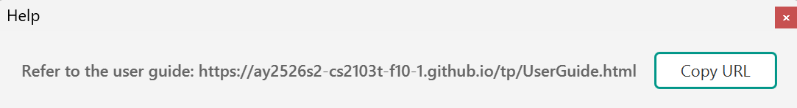
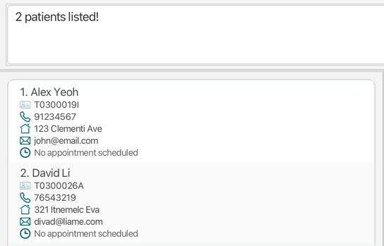

Do you prefer typing information than having to click on multiple things? DoctorWho is for you!

DoctorWho is a **desktop app for managing patient information and appointments, optimized for use via a Command Line Interface** (CLI) while still having the benefits of a Graphical User Interface (GUI). If you can type fast, DoctorWho can get your patient management tasks done faster than traditional GUI apps.

## Can DoctorWho help you?
Yes, if your clinic is still:
- Using paper filing to keep track of your patients and their appointments.
- Dealing with long search times in Excel.
- Paying exorbitant fees for enterprise grade software to track a handful of patients.

* Table of Contents
  {:toc}

--------------------------------------------------------------------------------------------------------------------

## Quick start

1. First, make sure you have Java `17` or above installed in your computer! 
   **Mac users:** Check out [this guide](https://se-education.org/guides/tutorials/javaInstallationMac.html) to get the exact JDK version you need.

2. Next, download the latest `doctorwho.jar` file from [here](https://github.com/AY2526S2-CS2103T-F10-1/tp/releases).

3. Then, move the `doctorwho.jar` file to the folder where you want to keep your contacts (we suggest you place it in a new, empty folder!)
   

4. Now, open up a command terminal, go to the folder where `doctorwho.jar` is, and use the `java -jar doctorwho.jar` command to run the application. You've just taken your first step toward managing contacts quickly!
   

5. You should now see some sample data. This is what DoctorWho will look like!
   

6. Type the command in the command box and press Enter to execute it. e.g. typing **`help`** and pressing Enter will open the help window. 
   Some example commands you can try:

    * `list` : Lists all patients.

    * `add n/John Doe p/98765432 e/johnd@example.com a/John street, block 123, #01-01` : Adds a patient named `John Doe` to the list of patients.

    * `delete 3` : Deletes the 3rd patient shown in the current list.

    * `apt 3 d/01-04-2026 09:00 dur/60 note/Follow-up for diabetes review` : Schedule an appointment for the 3rd patient shown in the current list.

    * `dapt 3` : Remove an appointment from the 3rd patient shown on the list.

7. Refer to the [Features](#features) below for details of each command, and [Command Summary](#command-summary) gives you a quick cheatsheet in case you forget.

--------------------------------------------------------------------------------------------------------------------

## Command Summary

Here is a quick reference list for the commands DoctorWho provides, more detailed information about all of the commands can be found in [Features](#features).

Action | Format, Examples
--------|------------------
**Add** | `add n/NAME p/PHONE_NUMBER e/EMAIL a/ADDRESS [al/ALLERGY] [c/CONDITION]…​`   e.g., `add n/James Ho p/22224444 e/jamesho@example.com a/123, Clementi Rd, 1234665 al/dust c/allergic rhinitis`
**Clear** | `clear`
**Delete** | `delete PATIENT_NUMBER`  e.g., `delete 3`
**Edit** | `edit PATIENT_NUMBER [n/NAME] [p/PHONE_NUMBER] [e/EMAIL] [a/ADDRESS] [al/ALLERGY] [c/CONDITION]…​`  e.g.,`edit 2 n/James Lee e/jameslee@example.com`
**Find** | `find KEYWORD [MORE_KEYWORDS]`  e.g., `find James Jake`
**Add appointments** | `apt PATIENT_NUMBER d/DATETIME dur/DURATION [note/NOTE]`  e.g., `apt 2 d/01-04-2026 09:00 dur/60 note/Follow-up for diabetes review`
**Delete appointments** | `dapt PATIENT_NUMBER`  e.g., `dapt 1`
**Help** | `help`

## Features

**:information_source: Notes about the command format:** 

* Words in `UPPER_CASE` are the parameters to be supplied by the user. 
  e.g. in `add n/NAME`, `NAME` is a parameter which can be used as `add n/John Doe`.

* Items in square brackets are optional. 
  e.g `n/NAME [al/ALLERGY]` can be used as `n/John Doe al/Aspirin` or as `n/John Doe`.
  E.g `n/NAME [c/CONDITION]` can be used as `n/Johnny c/High BP` or as `n/Johnny`

* Items with `…`​ after them can be used multiple times including zero times. 
  e.g. `[al/ALLERGY]…​` can be used as ` ` (i.e. 0 times), `al/Penicillin`, `al/Ibuprofen al/Aspirin` etc.]

* Parameters can be in any order. 
  e.g. if the command specifies `n/NAME p/PHONE_NUMBER`, `p/PHONE_NUMBER n/NAME` is also acceptable.

* Extraneous parameters for commands that do not take in parameters (such as `help`, `list`, `exit` and `clear`) will be ignored. 
  e.g. if the command specifies `help 123`, it will be interpreted as `help`.

* If you are using a PDF version of this document, be careful when copying and pasting commands that span multiple lines as space characters surrounding line-breaks may be omitted when copied over to the application.

### Viewing help : `help`

Shows a message explaining how to access the help page.

Format: `help`

## DoctorWho Operations:

### Adding a patient: `add`

Adds a patient to DoctorWho.

Format: `add n/NAME p/PHONE_NUMBER e/EMAIL a/ADDRESS [al/ALLERGY] [c/CONDITION]…​`

:bulb: **Tip:**
A patient can have any number of allergies or medical conditions (including 0)

Examples:
* `add n/John Doe p/98765432 e/johnd@example.com a/John street, block 123, #01-01`
* `add n/Betsy Crowe e/bcrowe@example.com a/Newgate Prison p/1234567 al/Penicillin c/cold`
* `add n/Tim Chal e/betsycrowe@example.com a/Newgate Prison p/1234567 al/Morphine`

### Listing all patients : `list`

Shows a list of all patients in DoctorWho.

Format: `list`

### Editing a patient : `edit`

Edits an existing patient in DoctorWho.

Format: `edit PATIENT_NUMBER [n/NAME] [p/PHONE] [e/EMAIL] [a/ADDRESS] [al/ALLERGY] [c/CONDITION]…​`

* Edits the patient at the specified `PATIENT_NUMBER`. The index refers to the index number shown in the displayed patient list. The index **must be a positive integer** 1, 2, 3, …​
* At least one of the optional fields must be provided.
* Existing values will be updated to the input values.
* When editing conditions and allergies, the existing ones of the patient will be removed i.e adding is not cumulative.
* You can remove all the patient’s allergies or medical conditions by typing `al/` or `c/` respectively, without specifying anything after it.

Examples:
*  `edit 1 p/91234567 e/johndoe@example.com` Edits the phone number and email address of the 1st patient to be `91234567` and `johndoe@example.com` respectively.
*  `edit 2 n/Betsy Crower al/ c/` Edits the name of the 2nd patient to be `Betsy Crower` and clears all existing allergies and medical conditions.

### Locating patients by name: `find`

Finds patients whose names contain any of the given keywords.

Format: `find KEYWORD [MORE_KEYWORDS]`

* The search is case-insensitive. e.g `hans` will match `Hans`
* The order of the keywords does not matter. e.g. `Hans Bo` will match `Bo Hans`
* Only the name is searched.
* Only full words will be matched e.g. `Han` will not match `Hans`
* Persons matching at least one keyword will be returned (i.e. `OR` search).
  e.g. `Hans Bo` will return `Hans Gruber`, `Bo Yang`

Examples:
* `find John` returns `john` and `John Doe`
* `find alex david` returns `Alex Yeoh`, `David Li` 
  

### Deleting a patient : `delete`

Deletes the specified patient from DoctorWho.

Format: `delete PATIENT_NUMBER`

* Deletes the patient at the specified `PATIENT_NUMBER`.
* The PATIENT_NUMBER **must be a positive integer** 1, 2, 3, …​

Examples:
* `list` followed by `delete 2` deletes the 2nd patient in DoctorWho.
* `find Betsy` followed by `delete 1` deletes the 1st patient in the results of the `find` command.

### Adding an appointment : `apt`
Adds an appointment for the specified patient in DoctorWho.

Format: `apt PATIENT_NUMBER d/DATETIME dur/DURATION [note/NOTE]`

* Creates and adds an appointment for the patient at the specified `PATIENT_NUMBER`.
* The PATIENT_NUMBER **must be a positive integer** 1, 2, 3, …​
* The date and time must be in the format `dd-mm-YYYY hh:mm` e.g, `01-04-2026 09:00` refers to 1st April 2026, 09:00 am.
* The duration **must be a positive integer** in **minutes**.

Examples:
* `apt 2 d/01-04-2026 09:00 dur/60 note/Follow-up for diabetes review` adds an appointment to the 2nd patient, from the top, of the patient list, scheduled for 1st April 2026, at 09:00 am. A note will be indicated with `Note | Follow-up for diabetes review`

### Deleting an appointment : `dapt`
Deletes an appointment for the specified patient in DoctorWho.

Format: `dapt PATIENT_NUMBER`

* Deletes the appointment for the patient at the specified `PATIENT_NUMBER`.
* The `PATIENT_NUMBER` refers to the index number shown in the displayed patient list.
* The `PATIENT_NUMBER` **must be a positive integer** 1, 2, 3, …​

Examples:
* `list` followed by `dapt 2` deletes the appointment for the 2nd patient in the displayed patient list.

### Clearing all entries : `clear`

Clears all entries from DoctorWho.

Format: `clear`

### Exiting the program : `exit`

Exits the program.

Format: `exit`

## Storage:
### Saving the data

DoctorWho data is saved in the hard disk automatically after any command that changes the data. There is no need to save manually.

### Editing the data file

DoctorWho data is saved automatically as a JSON file `[JAR file location]/data/DoctorWho.json`. Advanced users are welcome to update data directly by editing that data file.

:exclamation: **Caution:**
If your changes to the data file makes its format invalid, DoctorWho will discard all data and start with an empty data file at the next run. Hence, it is recommended to take a backup of the file before editing it. 
Furthermore, certain edits can cause the DoctorWho to behave in unexpected ways (e.g., if a value entered is outside of the acceptable range). Therefore, edit the data file only if you are confident that you can update it correctly.

### Archiving data files `[coming in v2.0]`

_Details coming soon ..._

--------------------------------------------------------------------------------------------------------------------

## Known issues

1. **When using multiple screens**, if you move the application to a secondary screen, and later switch to using only the primary screen, the GUI will open off-screen. The remedy is to delete the `preferences.json` file created by the application before running the application again.
2. **If you minimize the Help Window** and then run the `help` command (or use the `Help` menu, or the keyboard shortcut `F1`) again, the original Help Window will remain minimized, and no new Help Window will appear. The remedy is to manually restore the minimized Help Window.

--------------------------------------------------------------------------------------------------------------------
## FAQ

**Q**: How do I transfer my data to another Computer? 
**A**: Install the app in the other computer and overwrite the empty data file it creates with the file that contains the data of your previous DoctorWho home folder.

--------------------------------------------------------------------------------------------------------------------

## Glossary

* CLI: Command Line Interface. A text-based interface where users interact with a program by typing commands.
* GUI: Graphical User Interface. A visual-based interface where users interact with a program by interacting with windows, icons and menus.
* Java: The programming language used to implement this application.
* JSON: JavaScript Object Notation. A lightweight, text-based data interchange format, easily parsable by machines.
* JSON linter: A tool that checks and enforces the correct syntax, structure, and style of JSON data.
* Parameters: Inputs provided to a command. A command may have zero or more parameters depending on its functionality.
* Patient: A person receiving medical care whose information and appointments are managed within DoctorWho.
* Trailing commas: A comma placed at the end of a list of JSON entries before the closing bracket.
* UTF-8: The standard for how Unicode numbers are translated into binary numbers to be stored in the computer.
